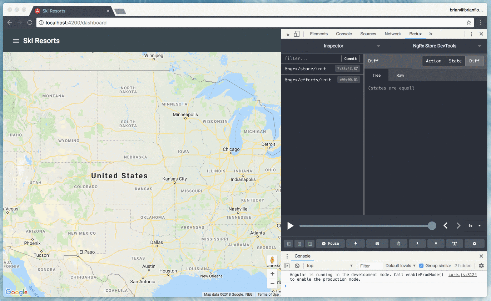

# Exercise: Dialog

To begin, checkout the *05-effects-exercise-1* branch:

```bash
git checkout 05-effects-exercise-1
```

🤫 The solution branch is available if you get stuck.

You can checkout the solution via:

```bash
git checkout 05-effects-exercise-1-solution
```

## Goals

* Practice declaring asynchronous actions.
* Practice declaring a reducer function.
* Practice declaring projector functions and selectors.
* Practice declaring an effects class.
* Practice selecting a slice of data from the state object.
* Practice dispatching actions.

## Steps

1. Create a new directory at **src/app/state/dialog**.
2. Create a new file at **src/app/state/dialog/dialog.actions.ts**.
3. Declare the following actions: `CloseDialogs` and `OpenDialog`. The `OpenDialog` action should require a `ComponentType` and an optional `MatDialogConfig` object in the `constructor()`. The `CloseDialogs` action will close all of the open dialogs.
4. Declare the `reducer()` function in a new file at **src/app/state/dialog/dialog.reducer.ts** and update an `opened` boolean property of the current feature state.
5. Declare the `DialogEffects` class and create two effects to `open` and `close` the dialog in **src/app/state/dialog/dialog/effects.ts**.
6. Add the `DialogEffects` class to the array of effects defined in the `EffectsModule.forRoot()` static method in **src/app/state/state.module.ts**.
7. Add the `dialog` feature state in **src/app/state/index.ts**.
8. Update the `ShellComponent.openDialog()` method in **src/app/core/shell/shell.component.ts** to dispatch the `OpenDialog` action.

## Hints

* While we are updating an `opened` boolean value in state, we're not going to create any selectors at this time. We could later use this value to determine the application's behavior when a dialog is opened (or not).
* Use the `{ dispatch: false }` option in the `@Effect()` decorator to prevent the effect from recursively dispatching the source action.
* Inject the `MatDialog` service to open and close dialogs. Refer to the [Angular Material documentation for the Dialog](https://material.angular.io/components/dialog/api).
* Use the `ofType()` operator to filter for a specific action.
* Use the `tap()` operator to perform a side effect in the sequence of operators in the observable `pipe()` method.

## Try it Out

Use the Redex Devtools to view the _[Dialog] Open Dialog_ action being dispatched:

