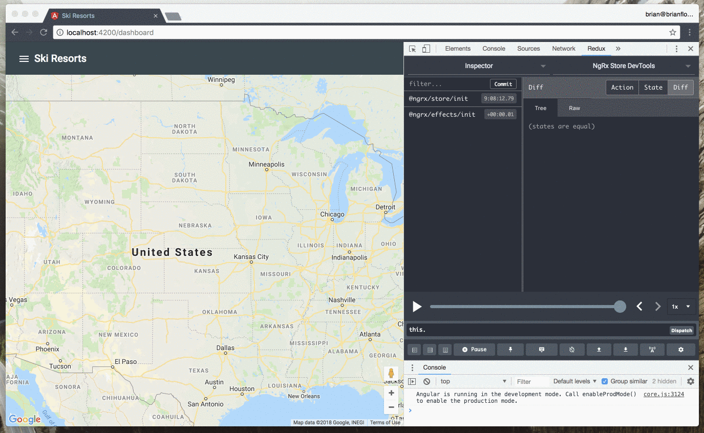
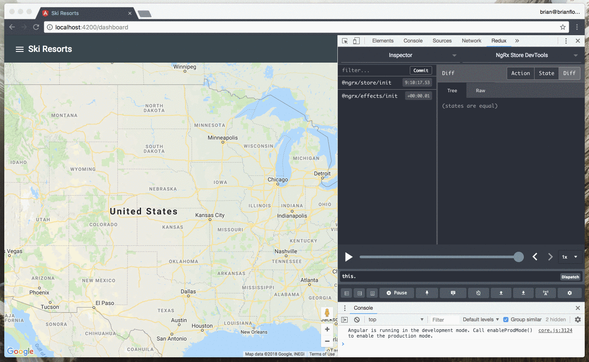

# Exercise 2: Close Dialog and Zoom

For this exercise let's iterate on improving the search functionality to:

* Close the search dialog by dispatching the `CloseDialogs` action when the backdrop is tapped/clicked.
* Close the search dialog by dispatching the `CloseDialogs` action when a resort is selected.
* Hide the sidenav by dispatching the `HideSidenav` action when a resort is selected.
* Set the zoom level higher after a resort is selected.

To begin, checkout the *06-effects-exercise-1* branch:

```bash
git checkout 06-effects-exercise-2
```

🤫 The solution branch is available if you get stuck.

You can checkout the solution via:

```bash
git checkout 06-effects-exercise-2-solution
```

## Goals

* Practice declaring actions.
* Practice dispatching actions from an effect.

## Step 1: Close Dialog

For the first iteration we want to dispatch the `CloseDialogs` action when the backdrop is tapped/clicked using an effect:

1. Remove the `{ dispatch: false }` option in the `@Effect` decorator for the `open` effect in **src/app/state/dialog/dialog.effects.ts**.
2. Set the `disableClose` configuration option for the dialog in **src/app/state/dialog/dialog.effects.ts**. This will disable the default behavior of closing the dialog when the backdrop is tapped/clicked.
3. Use the `switchMap()` operator to switch to the projected observable returned from `MatDialogRef.backdropClick()`.
4. Use the `map()` operator to return the `CloseDialogs` action.

For the next iteration we want to dispatch the `CloseDialogs` action when the `SelectResort` resort action is dispatched using an effect:

1. Add a new `closeDialogOnSelect` property to the `ResortEffects` class and decorate it using the `@Effect` decorator in **src/app/state/resort/resort.effects.ts**.
2. Use the `ofType()` operator to filter for the `SeletResort` action.
3. Use the `map()` operator to return the `CloseDialogs` action.

## Step 2: Hide Sidenav

Dispatch the `HideSidenav` action when the `SelectResort` action is dispatched using an effect:

1. Add a new `hideSidenavOnSelect` property to the `ResortEffects` class and decorate it using the `@Effect` decorator in **src/app/state/resort/resort.effects.ts**.
2. Use the `ofType()` operator to filter for the `SelectResort` action.
3. Use the `map()` operator to return the `Hidesidenav` action.

## Step 3: Set Zoom

Dispatch the `SetMapZoom` action when the `SelectResort` action is dispatched using an effect:

1. Add a new `setMapZoom` property to the `ResortEffects` class and decorate it using the `@Effect` decorator in **src/app/state/resort/resort.effects.ts**.
2. Use the `ofType()` operator to filter for the `SelectResort` action.
3. Use the `map()` operator to return the `SetMapZoom` action.

## Try it Out

Use the Redex Devtools to view the _[Dialog] Close Dialog_ action being dispatched:



The _[Sidenav] Hide Sidenav_ and _[Map] Set Zoom_ actions are dispatched when a resort is selected:

