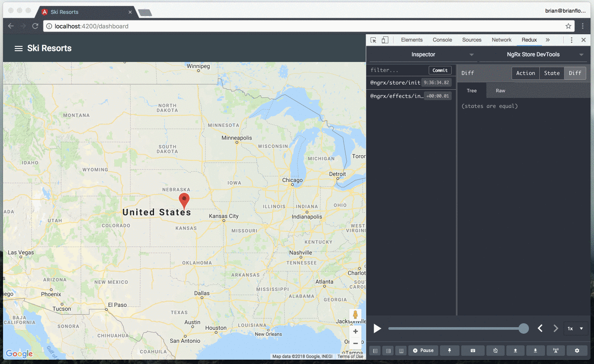
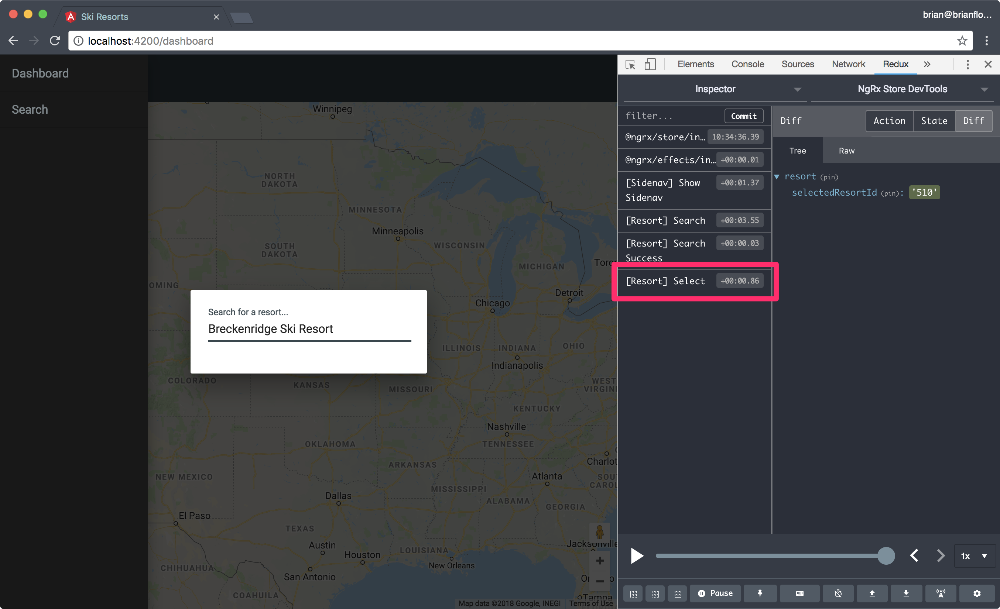

# Select a Resort

Add the functionality to dispatch an action when a resort is selected.
When a resort is selected center the map on the location and add a marker to the map for the resort.

## Declare Action

Open the **src/app/state/resort/resort.action.ts** file and update the `ResortActionTypes` enum to include a new `SelectResort` member:

```javascript
export enum ResortActionTypes {

  // code omitted

  SelectResort = '[Resort] Select'
}
```

Declare a new `SelectResort` action:

```javascript
export class SelectResort implements Action {
  readonly type = ResortActionTypes.SelectResort;

  constructor(public resort: Resort) {}
}
```

Add the `SelectResort` class to the `ResortActions` type:

```javascript
export type ResortActions =
  | SearchResorts
  | SearchResortsFail
  | SearchResortsSuccess
  | SelectResort;
```

## Update Reducer

Open **src/app/state/resort/resort.reducer.ts** file and add two properties to the resort `State` interface:

1. resorts - the collection of resorts that the user has selected.
2. selectedResortId - the currently selected resort id.

```javascript
export interface State {
  error?: Error | null;
  loading: boolean;
  resorts: Resort[];
  searchResults: Resort[];
  selectedResortId?: string;
}
```

Update the `initialState` object with the default value for `resorts`:

```javascript
export const initialState: State = {
  loading: false,
  resorts: [],
  searchResults: []
};
```

Update the `reducer()` function to mutate the `resorts` and `selectedResortId` properties when the `SelectResort` action is dispatched:

```javascript
export function reducer(state = initialState, action: ResortActions): State {
  switch (action.type) {
    
    // code omitted

    case ResortActionTypes.SelectResort:
      return {
        ...state,
        resorts: [...state.resorts, action.resort],
        selectedResortId: action.resort.id
      };
    default:
      return state;
  }
}
```

Finally, create projector functions to access the new state properties:

```javascript
export const getResorts = (state: State) => state.resorts;
export const getSelectedResortId = (state: State) => state.selectedResortId;
```

## Selectors

Open **src/app/state/index.ts** and create two new selectors, using the projector functions we declared:

```javascript
export const resorts = createSelector(resortState, getResorts);
export const selectedResortId = createSelector(
  resortState,
  getSelectedResortId
);
```

Next, use the `resorts` and `selectedResortId` selectors to compose a new `selectedResort` selector:

```javascript
export const selectedResort = createSelector(
  resorts,
  selectedResortId,
  (resorts, selectedResortId) =>
    selectedResortId && resorts.find(resort => resort.id === selectedResortId)
);
```

* The first argument is the `resorts` selector that returns the array of `Resort` objects.
* The second argument is the `selectedResortId` selector that returns the `id` value for the selected resort.
* The third argument is a projector function that accepts the values from the previous arguments, respective of the selectors specified.
* The projector function uses the `Array.prototype.find()` method to return the selected resort.

## `SearchDialogComponent`

Open the **src/app/containers/search-dialog/search-dialog.component.ts** file and update the `resortSelected()` method to dispatch the `SelectResort` action:

```javascript
export class SearchDialogComponent implements OnDestroy, OnInit {
  
  // code omitted

  resortSelected(event: MatAutocompleteSelectedEvent) {
    const resort: Resort = event.option.value;
    this.store.dispatch(new SelectResort(resort));
  }
}
```

## `DashboardComponent`

Open the **src/app/containers/dashboard/dashboard.component.ts** file and inject the `Store` singleton instance in the `constructor()` function:

```javascript
import { State } from '@app/state';
import { Store } from '@ngrx/store';

export class DashboardComponent implements OnInit {
  constructor(private store: Store<State>) {}
}
```

Then, update the `ngOnInit()` lifecycle method to declare the `resorts` and `selectedResort` property values using the appropriate selectors.

```javascript
import { Component, OnInit } from '@angular/core';
import { Resort } from '@app/models/resort.model';
import { resorts, selectedResort, State } from '@app/state';
import { select, Store } from '@ngrx/store';
import { Observable } from 'rxjs';

export class DashboardComponent implements OnInit {
  resorts: Observable<Array<Resort>>;
  selectedResort: Observable<Resort>;

  constructor(private store: Store<State>) {}

  ngOnInit() {
    this.resorts = this.store.pipe(select(resorts));
    this.selectedResort = this.store.pipe(select(selectedResort));
  }
}
```

## Serve the Application

Serve the application:

```bash
npm start
yarn start
```

Search for a ski resort, such as "Breck":



When you select a resort verify that the action is dispatched using the Redux Devtools:

