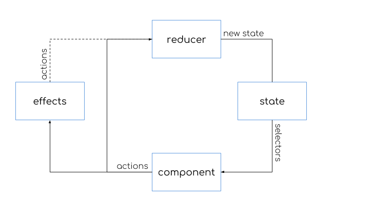

## Architecture of NgRX

* Components dispatch actions describing the state change
* Reducers are pure functions that return the new state
* Selectors access slices of state
* Optional effects perform side effects

