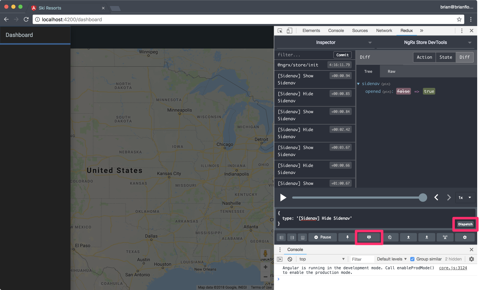
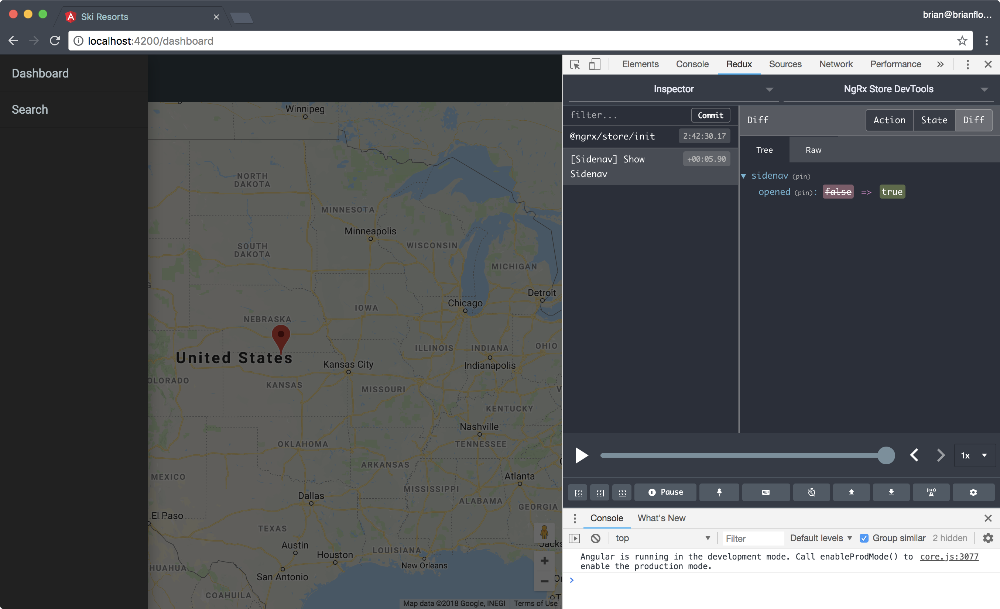
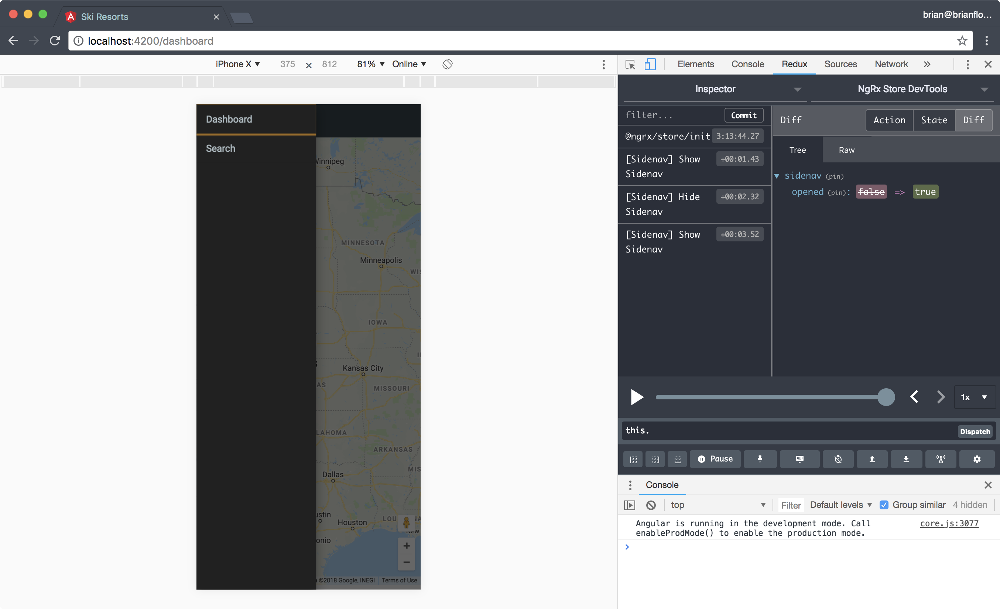

# Sidenav Dispatch

With the `opened` input binding defined in the template the sidenav is either opened or closed when the value in the state object is updated.

## Dispatch Action in Devtools

Let's test the binding using the Redux Devtools.

1. Serve the application.
2. Open the Redux Devtools.
3. Open the dispatch tool.
4. Specify an action object to be dispatch.
5. Click the Dispatch button.



The action object for showing the sidenav is:

```javascript
{
  type: '[Sidenav] Show Sidenav'
}
```

This is the type string that we defined as a member of the `SidenavActionTypes` enum in **src/app/state/sidenav/sidenav.actions.ts**.

When the Dispatch button is clicked you should see the sidenav open.

## Dispatch Action in ShellComponent

First, open the **src/app/core/shell/shell.component.ts** file and declare a new `openSidenav` method:

```javascript
import { ShowSidenav } from '@app/state/sidenav/sidenav.actions';

export class ShellComponent implements OnInit {
  // code omitted

  openSidenav() {
    this.store.dispatch(new ShowSidenav());
  }
}
```

* Invoke the `dispatch()` method on the `store` instance.
* Specify the `ShowSidenav` action to be dispatched.
* Be sure to new-up the `ShowSidenav` class.

## Invoke `openSidenav()` in Template

Open the **src/app/core/shell/shell.component.html** template and update the `<button>` in the `<mat-toolbar>` to invoke the `openSidenav()` method defined in the `ShellComponent` class:

```html
<button class="menu-button" mat-icon-button (click)="openSidenav()">
  <mat-icon>menu</mat-icon>
</button>
```

Open the application in your browser and click the hamburger (menu) button:



* When we click the button the sidenav is opened.
* The Redux Devtools is updated with the "[Sidenav] Show Sidenav" action.
* A diff of the new state of our application is shown.
* The `opened` value is set to `true`.

## Toggle Sidenav

Our Angular Material sidenav behaves differently based on the side of the browser/device:

* On mobile the sidenav is displayed over the content.
* On larger than a mobile devices the sidebar pushes the content to the right to display the sidenav on the left.

To get started, open **src/app/core/shell/shell.component.ts** and declare two new methods:

1. `closeSidenav()`
2. `toggleSidenav()`

```javascript
import { HideSidenav, ShowSidenav } from '@app/state/sidenav/sidenav.actions';
import { first } from 'rxjs/operators';

export class ShellComponent implements OnInit {
  // code omitted

  closeSidenav() {
    this.store.dispatch(new HideSidenav());
  }

  openSidenav() {
    this.store.dispatch(new ShowSidenav());
  }

  toggleSidenav() {
    this.opened.pipe(first()).subscribe(open => {
      if (open) {
        return this.closeSidenav();
      }
      this.openSidenav();
    });
  }
}
```

* The `closeSidenav()` method dispatches the `HideSidenav` action.
* The `toggleSidenav()` uses the `first()` operator to only listen to the first notification emitted by the `opened` observable when the method is invoked.
* We `subscribe()` to the notifacation and if the `open` boolean is `true` then we invoke the `closeSidenav()` method otherwise we invoke the `openSidenav()` method.

## Invoke `toggleSidenav()` in Template

We need to toggle the visibility of the sidenav when either the hamburger (menu) button or the container's backdrop is tapped/clicked.

Open **src/app/core/shell/shell.component.html** and update the `<button>` and the `<mat-sidenav-container>` components to invoke the `toggleSidenav()` method:

```html
<mat-sidenav-container (backdropClick)="toggleSidenav()" class="container" fxFlex>
  <mat-sidenav #sidenav [mode]="isMobile ? 'over' : 'side'" [opened]="opened | async">
    <!-- code omitted -->
  </mat-sidenav>

  <mat-sidenav-content>
    <mat-toolbar color="primary">
      <button class="menu-button" mat-icon-button (click)="toggleSidenav()">
        <mat-icon>menu</mat-icon>
      </button>
      <span>{{title}}</span>
    </mat-toolbar>
    <router-outlet></router-outlet>
  </mat-sidenav-content>
</mat-sidenav-container>
```

* Note the `backdropClick` output binding on the `<mat-sidenav-container>` component.
* Note the `click` output binding on the `<button>`.

Open the application in your browser and enable the device toolbar.
First, specify a width of 960 pixels or greater:


Then, specify a width less than 960 pixels:



* You can use the hamburger (menu) button in the toolbar to toggle the visibility of the sidenav on a non-mobile device as well as clicking/tapping the container's backdrop.
* You can open the sidenav using the hamburger (menu) button in the toolbar and close the sidenav by clicking/tapping the container's backdrop.
* Note the actions being dispatched in the Redux Devtools.

**Pro Tip**: Use the rewind and forward buttons or the  scrub bar in the Redux Devtools to time travel in your application.