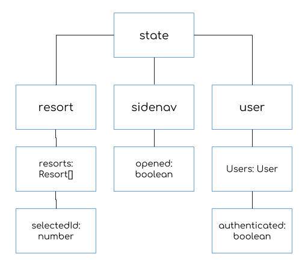

# Sidenav Selectors

Selectors enable us to query for a slice of the state object.
If you've working with a relational database, you can kind of think of selectors as similar to stored procedures.

Like stored procedures, selectors enable us to easily access data and are also optimized.
The optimization technique used with selectors is called [memoization]():

> In computing, memoization or memoisation is an optimization technique used primarily to speed up computer programs by storing the results of expensive function calls and returning the cached result when the same inputs occur again.

NgRx provides two functions for creating memoized selectors:

1. `createFeatureSelector()` returns a top-level property in the state object.
2. `createSelector()` returns a specific slice of data within a top-level property of the state object.

## State Tree

Think of the state object as a tree:



In this example the top-level properties (or feature properties) are:

* resort
* sidenav
* user

Within each top-level property we have child properties:

* Within the `resort` top-level property are two properties: `resorts` and `selectedId`. The `resorts` property is an array of `Resort` objects, and the `selectedId` property is a `number` that represents the selected resort in our application.
* Within the `sidenav` top-level property is `opened`, which is a `boolean` value.
* Within the `user` top-level property are two properties: `users` and `authenticated`.

## Declare Feature Selector

Open **src/app/state/index.ts** and create a new `sidenavState` feature selector to access the top-level `sidenav` property:

```javascript
import {
  ActionReducerMap,
  createFeatureSelector,
  MetaReducer
} from '@ngrx/store';

export const sidenavState = createFeatureSelector<SidenavState>(
  Features.sidenav
);
```

* Note that we use the `createFeatureSelector()` function to access the top-level `sidenav` property.
* We declare the `SidenavState` generic to specify the type inerface that our feature selector returns.
* we use the `sidenav` member of the `Features` enum to ensure that the string value matches the property names declared in the root `State` interface and `reducers` map.

## Declare Projector Function

I like to declare projector functions within each **reducer.ts** file for accessing a property's value within each feature state.

Open the **src/app/state/sidenav/sidenav.reducer.ts** file and add a new `getOpened()` function:

```javascript
export const getOpened = (state: State) => state.opened;
```

We'll use this projector function when declaring a selector to access the `opened` value.

**Pro Tip**: The `getOpened()` projector function is *NOT* a selector.
Selectors are memoized using the `createSelector()` or `createFeatureSelector()` functions.
This is simply a projector function that returns the `boolean` value of the `opened` property within the sidenav `feature` state.

## Declare Selector

Finally, open **src/app/state/index.ts** and declare a new `isOpened()` selector function:

```javascript
import {
  ActionReducerMap,
  createFeatureSelector,
  createSelector,
  MetaReducer
} from '@ngrx/store';

export const isOpened = createSelector(sidenavState, getOpened);
```

* We use the `createSelector()` function to declare a new selector.
* We compose selectors using other selectors along with a projector function.

## Composing Selectors

The `createSelector()` function can accept up to 8 selectors.
This enables us to compose selectors together in order to "query" for a slice of data within the state object.
The last argument is always the `projector` function.

When declaring a selector using a single selector function as the source, the `projector` function is invoked with a single argument, which is the value that is emitted by the selector.
Let's take a look at the TypeScript declaration for `createSelector()` with a single selector argument:

```javascript
export declare function createSelector<State, S1, Result>(s1: Selector<State, S1>, projector: (S1: S1) => Result): MemoizedSelector<State, Result>;
```

* The first argument, `s1`, is a `Selector` function that returns the `S1` type for the given `State`.
* The second argument, `projector`, is a function that receives the `S1` value (which is of type `S1`) and returns the `Result`.

When we declared the `isOpened` selector we specified the `sidenavState` (feature) selector as the first argument.
If you recall, this returns the `sidenav` feature state, which is an object with the property `opened`.

The second argument is the `getOpened` projector function, which accepts the `sidenav` feature state and returns the value of the `opened` property.

## Inline Projector

We _could_ have declared the `isOpened` selector with the `projector` function inline:

```javascript
export const isOpened = createSelector(sidenavState, (state: SidenavState) => state.opened);
```

**Pro Tip**: How you define the projector function is a matter of preference.

<!-- When declaring a selector with multipe selectors, the `projector` function is invoked with many arguments respective of the selectors specified.
For example, we might compose a selector with multiple arguments to access the selected resort within our application:

```javascript
export const resorts = createSelector(resortState, getResorts);

export const selectedResortId = createSelector(resortState, getSelectedResortId);

export const selectedResort = createSelector(
  resorts,
  selectedResortId,
  (resorts: Resort[], selectedResortId: number) => resorts.find(resort => resort.id === selectedResortId)
)
```

In the example above we specify two selector functions: `resorts` and `selectedResortId` -->