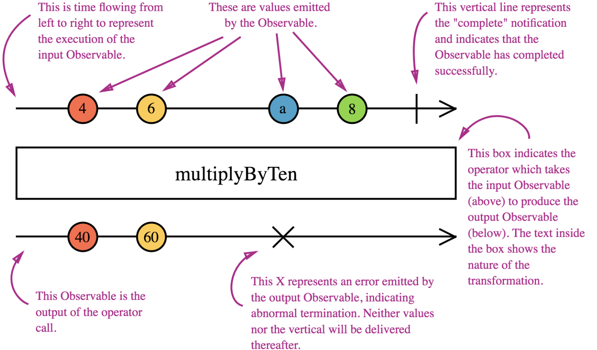

# Marble Testing

* Marble testing provide a simple way to describe observable streams.
* They can be used to model and test observables.
* They can also be used to model and test subscriptions.
* Uses a scheduler to provide timing.
* Timing is done frame-by-frame.
* Each character in a marble is 10 frames​. A frame is a virtual "millisecond" or "clock cycle" of the scheduler.

## Marble Diagram

Review a marble diagram:



## Syntax

* The first character is "zero frame".
* A dash "-" represents the passage of 10 frames.
* A pipe "|" indicates completion notification.
* A hash "#" indicates error notification.
* A carrot "^" indicates subscription point in a hot observable.
* Any other character indicates next notification.

## Examples

Emit a value and complete:

```javascript
cold("--a--|");
```

* Two dashes "-" represents the passage of 20 frames.
* The letter "a" represents our first emitted value.
* A pipe "|" represents completion.
* The mocked cold observable is a total of 60 frames.

Emit a value and error:

```javascript
cold("--a--#");
```

* Two dashes "-" represent the passage of 20 frames.
* The letter "a" represents our first emitted value.
* A pipe "#" represents an error.
* The mocked cold observable is 60 frames.

Emit multiple values and complete:

```javascript
cold("--a-b--|");
```

* The letter "a" represents our first emitted value.
* The letter "b" represents our second emitted value.
* The observable is 80 frames.

## Cold vs Hot

* A cold observable does not produce values until there is at least one subscriber until complete or all subscribers have unsubscribed.
* A hot observable produces values regardless of the subscribers.